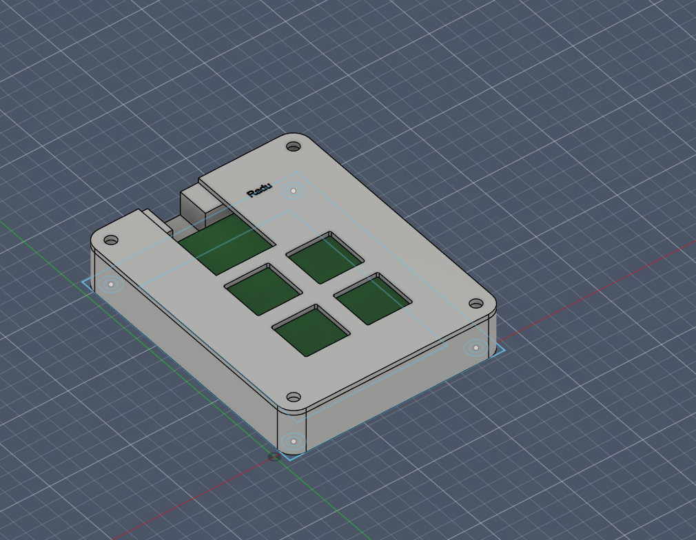
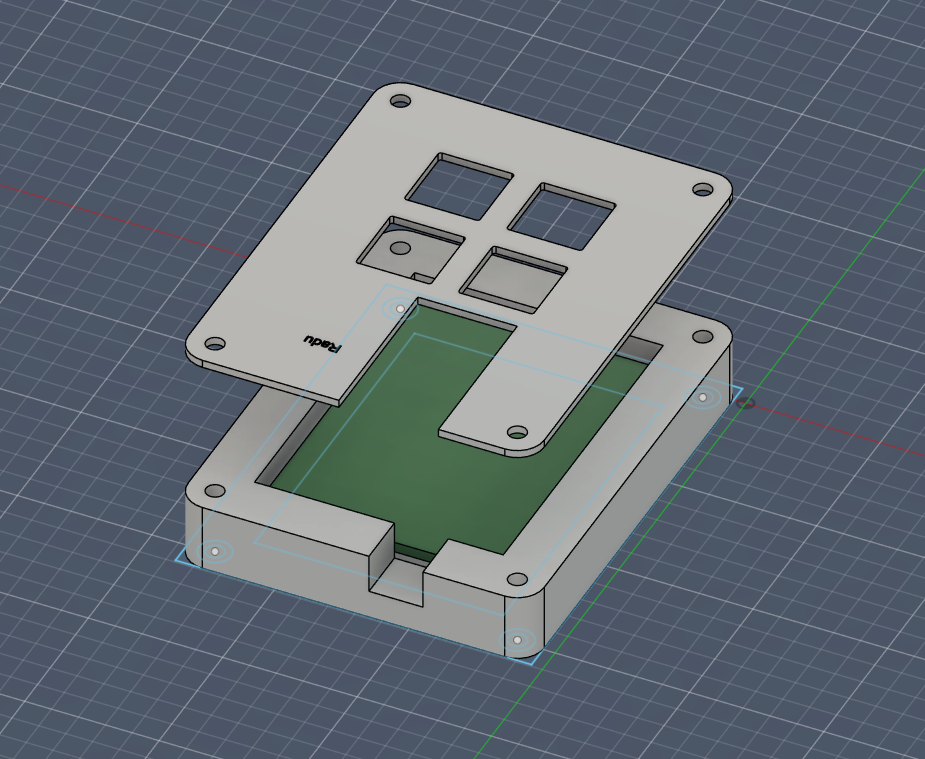
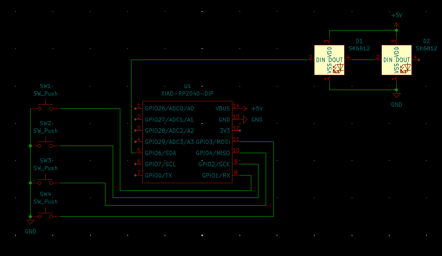
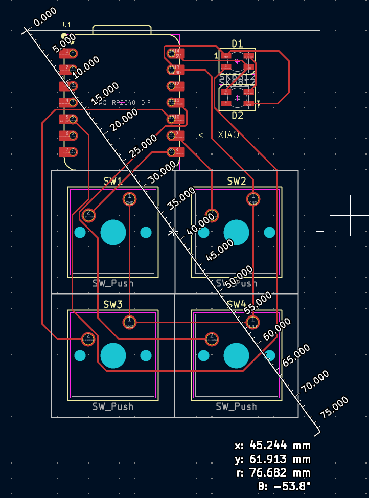

This is my recreation of the Macropad tutorial on HackClub. Additionally it's my first time designing a PCB which i really wanted to get into for a while now.

BOM (except pcb and case):

4x SW_Cherry_MX_1.00u_PCB
/
1x XIAO-RP2040-DIP
/
1x LED_SK6812MINI_PLCC4_3.5x3.5mm_P1.75mm

